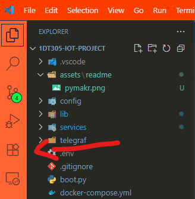
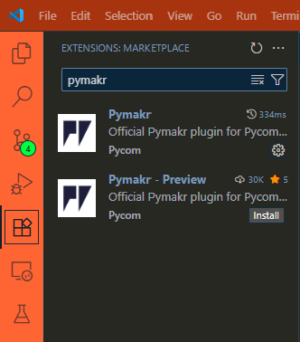
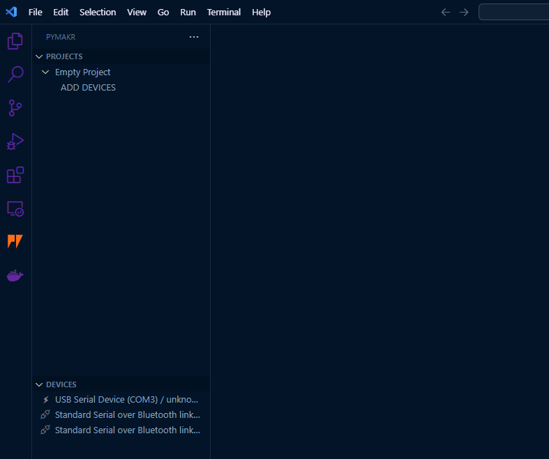
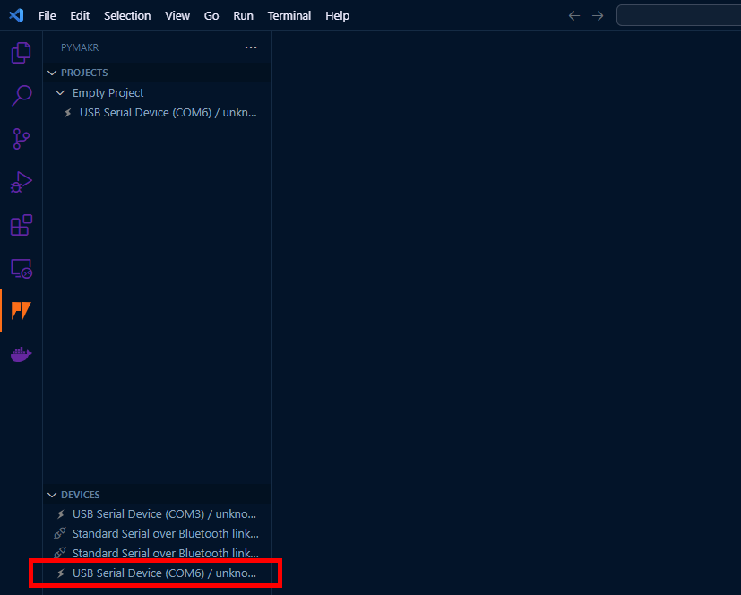
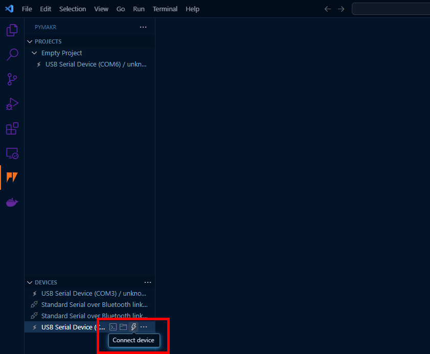
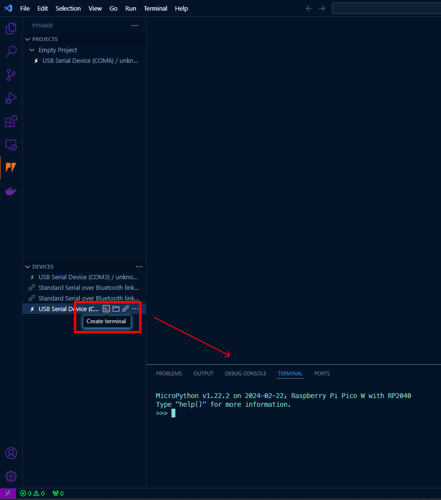
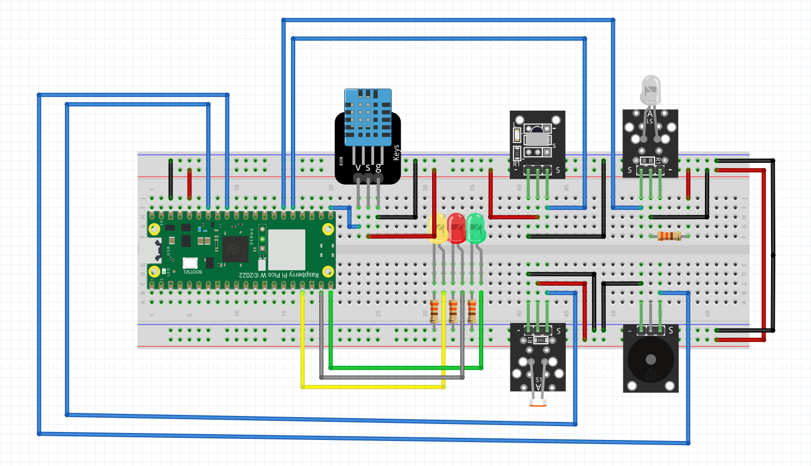
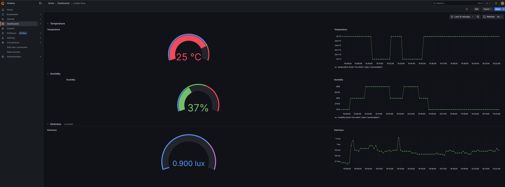
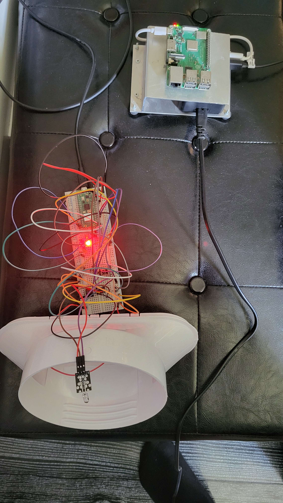
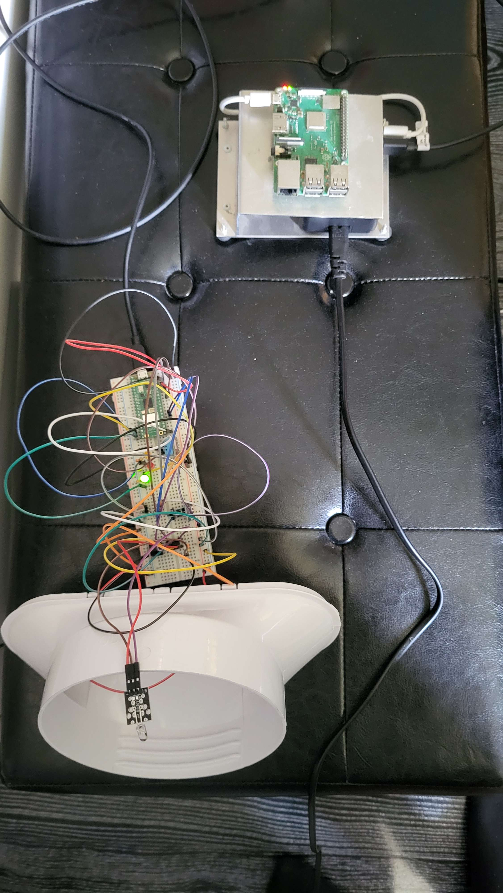

# Smart Climate Control System

| Name | Student ID |
| ---- | ---------- |
| Ludwig Wittenberg | lw223cq |

## Table of Contents

- [Overview](#overview)
- [Objective](#objective)
- [Course 1DT305 IoT Project](#course-1dt305-iot-project)
- [Materials](#materials)
- [Computer Setup](#computer-setup)
  - [Flashing the Firmware](#flashing-the-firmware)
  - [Installing VSCode and Pymakr Plugin](#installing-vscode-and-pymakr-plugin)
  - [Install Required Software](#install-required-software)
  - [Setting Up the Project in VSCode](#setting-up-the-project-in-vscode)
- [Putting Everything Together](#putting-everything-together)
  - [Schema](#schema)
  - [Explanation of the Schema](#explanation-of-the-schema)
    - [Sensors](#sensors)
    - [Calculating the Resistors](#calculating-the-resistors)
      - [Ohm’s Law](#ohms-law)
      - [Example Calculation](#example-calculation)
- [Installation Guide](#installation-guide)
- [LED Indicators](#led-indicators)
- [Platform](#platform)
  - [Hosting](#hosting)
- [The Code](#the-code)
- [Presenting the Data](#presenting-the-data)
- [Finalizing the Design](#finalizing-the-design)

## Overview

The Smart Climate Control System is an advanced solution designed to intelligently manage and optimize indoor climate conditions in buildings. By integrating sensors, the system continuously monitors temperature levels and automatically adjusts the environment to ensure optimal comfort. At the same time, it prioritizes energy efficiency, reducing unnecessary consumption without compromising performance.

It has an DHT11 sensor for measuring temperature and humidity, an IR receiver for controlling an air conditioner, and a light sensor to adjust the system based on ambient light levels. The system is designed to be energy-efficient and can be easily integrated with other IoT devices.

**Estimated Time:** 5 hours

## Objective

I’ve always found it uncomfortable when a room gets too hot, and I’ve also had a growing interest in IoT technology. That inspired me to take on this project as my first step into building a smart, connected device. The goal of the Smart Climate Control System is to create a temperature-aware system that can automatically adjust the indoor climate based on user-defined preferences. At the same time, it’s designed to operate in an energy-efficient way, making it both convenient and sustainable.

### Course 1DT305 IoT Project

This project is part of the [1DT305 IoT Project course at LNU](https://lnu.se/kurs/tillampad-internet-of-things-introduktion/distans-internationell-engelska-sommar/), where students are required to design and implement an IoT solution that addresses a real-world problem. The project involves using various sensors, microcontrollers, and software tools to create a functional IoT device.


## Materials

Here is a list of the components used in this project, along with their prices and links to where they can be purchased. The prices are in Swedish Krona (SEK) and may vary depending on the retailer.

> **Important Notice:** To fully utilize this system, you must have an air conditioner that can be controlled via an infrared (IR) remote.

| Amount | Component | Description | Price | Link |
| ------ | --------- | ----------- | ----- | ---- |
| ***1x*** | Raspberry Pi Pico WH | Microcontroller with built-in Wi-Fi | 99 SEK | [Electrokit](https://www.electrokit.com/raspberry-pi-pico-wh) |
| ***1x*** | Digital Temperature and Humidity Sensor DHT11 | Sensor for measuring temperature and humidity | 49 SEK | [Electrokit](https://www.electrokit.com/digital-temperatur-och-fuktsensor-dht11) |
| ***1x*** | IR Sensor 38kHz Shielded | Receiver for IR signals with 38kHz modulation | 34 SEK | [Electrokit](https://www.electrokit.com/ir-sensor-38khz-skarmad) |
| ***1x*** | IR Transmitter 38kHz | Transmitter for IR signals with 38kHz modulation | 29 SEK | [Electrokit](https://www.electrokit.com/ir-sandare-38khz) |
| ***1x*** | Passive Piezo Buzzer Module | Can be used as a loudspeaker by feeding it with an audio signal | 29 SEK | [Electrokit](https://www.electrokit.com/en/piezohogtalare-passiv) |
| ***1x*** | Light Sensor Module | Module with a light-dependent resistor that can be used as a simple light sensor where the amount of light determines the output voltage | 39 SEK | [Electrokit](https://www.electrokit.com/en/ljussensor) |
| ***1x*** | LED 5mm Red Diffuse 1500mcd | Red LED | 5 SEK | [Electrokit](https://www.electrokit.com/en/led-5mm-rod-diffus-1500mcd) |
| ***1x*** | LED 5mm Yellow Diffuse 1500mcd | Yellow LED | 5 SEK | [Electrokit](https://www.electrokit.com/en/led-5mm-gul-diffus-1500mcd) |
| ***1x*** | LED 5mm Green Diffuse 80mcd | Green LED | 5 SEK | [Electrokit](https://www.electrokit.com/en/led-5mm-gron-diffus-80mcd) |
| ***4x*** | Resistor Carbon Film 0.25W 330Ω (330R) | Carbon film resistor 0.25W 330Ω | 1 SEK | [Electrokit](https://www.electrokit.com/en/motstand-kolfilm-0.25w-330ohm-330r) |
| ***1x*** | Solderless Breadboard 840 Tie-Points | Breadboard for solder-free experiment circuits | 69 SEK | [Electrokit](https://www.electrokit.com/en/kopplingsdack-840-anslutningar) |
| ***21x*** | Jumper Wire Cable 40-Pin 30cm with Dupont Male/Male | 40-pin jumper wire cable with mounted Dupont connectors | 55 SEK | [Electrokit](https://www.electrokit.com/en/labbsladd-40-pin-30cm-hane/hane) |
| ***1x*** | ***Optional*** Jumper Wire Cable 40-Pin 30cm with Dupont Male/Female | 40-pin jumper wire cable with mounted Dupont connectors | 55 SEK | [Electrokit](https://www.electrokit.com/en/labbsladd-40-pin-30cm-hona/hane) |

## Computer Setup

### Flashing the Firmware

1. Download the MicroPython firmware:

   - Visit the [Raspberry Pi Pico MicroPython download page](https://www.raspberrypi.com/documentation/microcontrollers/micropython.html).

   - Download the latest UF2 file for the Raspberry Pi Pico W.

2. Connect the Pico W to your computer:

    - Hold down the BOOTSEL button on the Pico W and connect it to your computer via a USB cable. Release the [BOOTSEL button](https://www.reddit.com/media?url=https%3A%2F%2Fi.redd.it%2Fkuwwmhxj2al61.png) after connecting.

3. Flash the MicroPython firmware:

    - The Pico W should appear as a mass storage device on your computer.

    - Drag and drop the downloaded UF2 file onto the Pico W's mass storage device. The device will reboot automatically and appear as a USB serial device.

### Installing VSCode and Pymakr Plugin

1. Install Visual Studio Code (VSCode):

    - Download and install Visual Studio Code from the [official website](https://code.visualstudio.com/download).

2. Install Pymakr Plugin:

    - Open VSCode and go to the Extensions view by clicking the Extensions icon in the Activity Bar on the side of the window.

    

    - Search for "Pymakr" and click "Install" on the Pymakr plugin by Pycom.

    

3. Configure Pymakr Plugin:

    - After installing the Pymakr plugin, you need to configure it to communicate with your Pico W.

    - Click on the Pymakr icon on the VSCode status bar. At the bottom, a list of identified devices can be seen.

    

    - Connect your Pico W to your computer while watching the list of devices. A new device will appear in the list. That is the Pico W.

    

    - Hover over the device and press "Connect Device".

    

    - Hover over the device and create a terminal for the device.

    

### Install Required Software

#### Installing Node.js

1. Install Node.js:

    - Download and install Node.js from the [official website](https://nodejs.org/en).

    - Node.js is required for some of the Pymakr functionalities.

### Setting Up the Project in VSCode

1. Create a new MicroPython project in VSCode:

   - Open VSCode and create a new folder for your project.

   - Inside this folder, create a new Python file (e.g., `main.py`) and write your MicroPython code.

2. Connect to the Pico W:

    - Ensure your Pico W is connected to your computer via USB.

    - Click the Pymakr icon on the status bar and select "Connect".

3. Upload the code:

    - Once connected, you can upload your code to the Pico W by clicking the Pymakr icon and selecting "Sync Project to Device".

    - The code will be transferred to the Pico W and run automatically.

    - You may also start development mode, automatically uploading changed files to the device and restarting it.

## Putting Everything Together

### Schema


If you want to download the [Schema.fzz](https://github.com/LudwigWittenberg/1DT305-IoT-Project/blob/main/Schema.fzz) and play around with it in Fritzing, you can do so by downloading the [Fritzing software](https://fritzing.org/download/).

### Explanation of the Schema

- The Raspberry Pi Pico WH is placed in the center of the breadboard.
- Connect the **ground** from the Pico to the **ground rail** on the breadboard.
- Connect the **3.3V** pin from the Pico to the **power rail** on the breadboard.

Connect both sides of the breadboard power and ground rails to the Pico WH.

#### Sensors

- **DHT11 Sensor**: GPIO 16 (data), ground rail, power rail.
- **IR Receiver**: GPIO 19 (data), ground rail, power rail.
- **IR Transmitter**: GPIO 20 (data), ground rail, power rail (with 330Ω resistor).
- **Light Sensor**: GPIO 28 (data), ground rail, power rail.
- **Piezo Buzzer**: GPIO 27 (data), ground rail.
- **LEDs**: GPIO 13, GPIO 14, GPIO 15 (data), ground rail (with 330Ω resistor).

#### Calculating the Resistors

##### Why 330Ω Resistors Are Used for LEDs (3.3V Logic)

When connecting an LED to a 3.3V microcontroller (e.g., Raspberry Pi Pico), it's important to limit the current using a resistor to prevent damage to the LED.

##### Ohm’s Law

To calculate the resistor value, we use:

R = (V_supply - V_LED) / I

Where:
- `V_supply` = 3.3V (from the microcontroller)
- `V_LED` ≈ 2.0V (for a standard red LED)
- `I` = 10–20 mA (typical LED current, here we use 5–10 mA for efficiency)

##### Example Calculation

Assuming:
- `V_supply` = 3.3V
- `V_LED` = 2.0V
- `I` = 0.010A (10 mA)

We get:

R = (3.3V - 2.0V) / 0.010A = 130Ω

But with a **330Ω resistor**, we get lower current:

R = (3.3V - 2.0V) / 0.0039A ≈ 330Ω

##### Why 330Ω?

- Protects the LED by significantly reducing current.
- Still allows the LED to light up (bright enough for indication).
- Extends LED lifespan.
- Saves power, which is useful for battery-powered or energy-efficient systems.
- 330Ω is a commonly available standard resistor.

### Installation Guide

1. Clone the repository:

```bash
git clone https://github.com/LudwigWittenberg/1DT305-IoT-Project.git
```

2. Go to your Pico project folder in VSCode and open the terminal.

3. Move the files to the Pico WH:

4. Here we need to create the configuration files for the device. You can find the configuration files in the `config` folder in the repository. Copy the files to the Pico WH using the terminal:
You will have the following files in config folder:

```bash
example.MQTTConfig.py
example.WifiConfig.py
PinConfig.py
ValueConfig.py
```
4.1 Rename the `example.MQTTConfig.py` to `MQTTConfig.py` and `example.WifiConfig.py` to `WifiConfig.py`.

4.2 In the `MQTTConfig.py` file, you can set the MQTT broker address, port, username, and password. If you don't want to use MQTT, you need to set `MQTT_ENABLE = False`. If you would like to use the TIG stack, you need to set `WIFI_ENABLE = True` and `MQTT_ENABLE = True`.

```python
# ------- MQTT CREDENTIALS -------
MQTT_ENABLE = False # Enable or diable the MQTT service
MQTT_SERVER_IP = 'your-mqtt-server-ip'
MQTT_USERNAME = 'your-mqtt-username'
MQTT_PASSWORD = 'your-mqtt-password'
# --------------------------------
```

4.3 In the `WifiConfig.py` file, you can set the Wi-Fi credentials. If you don't want to use Wi-Fi, you need to set `WIFI_ENABLE = False`. If you would like to use the TIG stack, you need to set `WIFI_ENABLE = True` and `MQTT_ENABLE = True`.

```python
# ------------- WIFI -------------
WIFI_CONNECTION: False # Enable or disable the Wi-Fi connection
WIFI_SSID = 'your-wifi-name'
WIFI_PASS = 'your-wifi-password'
# --------------------------------
```

4.4 In the `PinConfig.py` file, you can set the GPIO pins for the sensors and components. You can change the pins if you want to use different pins.

```python
# ------------- PINS -------------
DHT_SENSOR_PIN = 16
YELLOW_LED_PIN = 13
GREEN_LED_PIN = 15
RED_LED_PIN = 14
IR_RECIVER_PIN = 19
IR_TRANSMITTER_PIN = 20
PHOTO_PIN = 28
PIEZO_PIN = 27
# --------------------------------
```

4.5 In the `ValueConfig.py` file, you can set the values for the sensors and components. You can change the values if you want to use different values. The ``MAX_TEMP`` value is the maximum temperature for the system to turn on the AC. The ``DARKNESS_LEVEL`` value is the light level for the system to turn off eveything. When it is do dark the system will not be able to turn the ac on/off. You can change these values to your liking.

```python
# ----------- SETTINGS -----------
MAX_TEMP = 25
DARKNESS_LEVEL = 70
# --------------------------------
```

5. Upload the files to the Pico WH using the Pymakr plugin in VSCode. You can do this by clicking on the Pymakr icon in the status bar and selecting "Sync Project to Device". This will upload all the files in your project folder to the Pico WH.

6. When first running the code it will try to connect to the Wi-Fi network. If the connection is successful, it will print a success message. If the connection fails, it will print an error message. But only if you have set `WIFI_ENABLE = True` in the `WifiConfig.py` file. If you have set `WIFI_ENABLE = False`, it will not try to connect to the Wi-Fi network. When successfully connected to the Wi-Fi network (Picos, Led will start to blink), the system will start the setup process. The setup process will map the IR codes of the AC remote and save them to the device's configuration. It will also create a signal when the setup is completed.

7. When you are in the setup process the yellow LED will be on, It then waits for you to press the `ON` button on the AC remote. When you press the `ON` button, the system will record the IR code and save it to the device's configuration. The green LED will then turn on to indicate that the IR code has been recorded successfully. The system will then wait for you to press the `OFF` button on the AC remote. When you press the `OFF` button, the system will record the IR code and save it to the device's configuration. The green LED will then turn on to indicate that the IR code has been recorded successfully. After that, the setup process is completed and the system will start running. You will be able to see this by the green LED blinking for a few seconds. The system will then start monitoring the temperature and humidity, and control the AC based on the user-defined preferences.

8. If you want to run the TIG stack on your Raspberry Pi Pico WH, you need to set `WIFI_ENABLE = True` and `MQTT_ENABLE = True` in the `WifiConfig.py` and `MQTTConfig.py` files. This will enable the Wi-Fi connection and MQTT service, allowing the system to send data to the InfluxDB database and visualize it in Grafana.

8.1 Use this `docker-compose.yml` file to run the TIG stack on your Raspberry Pi Pico WH:

[docker-compose.yml](./docker-compose.yml)

For futher instructions on how to set up the TIG stack, you can check the [Installation Guide](https://www.influxdata.com/blog/tig-stack-guide-influxdb-core/)

## LED Indicators

The Smart Climate Control System uses LEDs to indicate the status of the system. The following LED indicators are used:

- **Green LED**: Indicates that the temperature is within the user-defined range and the system is operating normally.
- **Yellow LED**: Indicates that the system is in setup mode and waiting for the user to press the `ON` or `OFF` button on the AC remote.
- **Red LED**: Indicates that the temperature is above the user-defined range and the system is trying to turn on the AC.

## Platform

For this project, I chose the **TIG stack** (Telegraf, InfluxDB, Grafana) primarily because I had used it in a previous assignment and was already familiar with its setup and functionality.

- **Telegraf**: A plugin-driven server agent for collecting and reporting metrics and events from various sources, such as databases, systems, and IoT sensors.
- **InfluxDB**: A time-series database optimized for high write and query loads, making it ideal for storing continuous sensor data like temperature readings.
- **Grafana**: A powerful visualization and analytics platform that enables the creation of interactive dashboards and graphs based on data from sources like InfluxDB.

### Hosting

I had an old **Raspberry Pi 3B** from my high school days, so I decided to repurpose it as a local server for the TIG stack. I installed the latest version of Raspberry Pi OS and set up Telegraf, InfluxDB, and Grafana directly on it.

A local server setup was ideal for this project because:

- I don’t need remote access to the data via the internet
- I can easily access the system from within my local network
- It’s a cost-effective and energy-efficient solution for small IoT projects

## The Code

The code for the Smart Climate Control System is organized into several Python files, each serving a specific purpose. Below is a brief overview of the main files:

#### main.py

This is the main entry point of the application. It initializes the system, sets up the sensors, and starts the main loop to continuously monitor and control the indoor climate. This is just a bit of the `main.py` file, the full code can be found in the [GitHub repository](https://github.com/LudwigWittenberg/1DT305-IoT-Project). But here we can see how the setup process works, and the main loop that runs the system. When the system is started, it checks if the device is configured. If not, it starts the setup process. After that, it enters an infinite loop where it checks the system status and temperature, and publishes data to MQTT if enabled. In the bottom we can see the system sends the data to the MQTT broker if both Wi-Fi and MQTT are enabled.

```python
# ------------- MQTT -------------
wifiEnable = WIFI_ENABLE or False
mqttEnable = MQTT_ENABLE or False


if wifiEnable and mqttEnable:
  mqtt = MQTTService()
  mqtt.connect()
  dataService = DataService(dhtSensor, photoSensor, system, temperatureService)
# --------------------------------

# ------------- SETUP -------------
# First we need to set up a config for the device
if not device.is_configured():
  print('--------- Setup Started ---------')
  device.start_setup_process()
  print('-------- Setup Completed --------')
  # Make sure the config is in place
  sleep(2)

# ------------- START -------------
def run():
  try:
    while True:
      system.check_system_status()
      if system.get_system_status():
        temperatureService.check_temp()
      
      # If wifi is enabled we will puplish the data to MQTT
      if wifiEnable and mqttEnable:
        data = dataService.get_data()
        mqtt.publish(data)
        
      # stop infinit loop
      sleep(10)
  except Exception as e:
    print("Error in code: ", e)
    
run()
```

#### DeviceConfig.py

This file contains the `DeviceConfig` class, which is responsible for managing the device configuration. It will map the IR codes of the AC remote and save them to the device's configuration. It also handles the setup process for the device, including checking if the device is configured and starting the setup process. Here we can see how the system handles the setup process for the device, including checking if the device is configured and starting the setup process. It also creates a signal when the setup is completed.

```python
from time import sleep_ms

# ---------- ALL CODES ----------
keys = [
  'AC_ON',
  'AC_OFF'
]
# -------------------------------

class DeviceConfig:
  def __init__(self, irReciver, yelloLed, greenLed):
    self.irReciver = irReciver
    self.yellowLed = yelloLed
    self.greenLed = greenLed
  
  # Check if the device is configured (mapped all IR Signals)
  def is_configured(self):
    return (self.irReciver.get_length() == len(keys))
  
  # Start the process to setup the device and configure the IR signals
  def start_setup_process(self):
    for key in keys:
      self.yellowLed.on()
      self.irReciver.record(key)
      sleep_ms(200)
      self.greenLed.on()
      sleep_ms(200)
      self.greenLed.off()
    
    self.setup_completed()
    
  # Creates a signal when the setup is completed
  def setup_completed(self):
    sleep_ms(1000)
    for i in range(5):
      sleep_ms(200)
      self.greenLed.on()
      sleep_ms(200)
      self.greenLed.off()
    
    self.yellowLed.off()
```

The `boot.py` file is responsible for establish a wifi connection when the device boots up. It checks if the Wi-Fi credentials are set in the configuration and attempts to connect to the specified Wi-Fi network. If the connection is successful, it prints a success message; otherwise, it prints an error message.

```python
# boot.py -- run on boot-up
from services.ConnectWifi import ConnectWifi
from config.WifiConfig import WIFI_ENABLE

if WIFI_ENABLE:
  wifi = ConnectWifi()
  wifi.connect()
```

I have some config files that needs to be set up before running the code. These files are used to store the configuration for the device, such as Wi-Fi credentials, MQTT settings, and other parameters. The `config` folder contains these configuration files, which are read by the main code to set up the device. For more information about the configuration files, you can check the [Installation Guide](https://github.com/LudwigWittenberg/1DT305-IoT-Project)

If you want to see the full code, you can find it in the [GitHub repository](https://github.com/LudwigWittenberg/1DT305-IoT-Project)

## Presenting the Data

The data collected by the Smart Climate Control System is presented using Grafana, which allows for real-time visualization of the temperature and humidity data. The data is stored in InfluxDB, and Grafana is configured to query this data and display it in a user-friendly dashboard. The data is updated every 10 seconds, providing a live view of the indoor climate conditions.

I have used the MQTT protocol to send the data from the Raspberry Pi Pico WH to the InfluxDB database. The data is sent in JSON format, which is then parsed by InfluxDB and stored in the database. Grafana is configured to query this data and display it in a dashboard. Using Wifi and MQTT allows for easy integration with other IoT devices and services, making it a flexible solution for monitoring and controlling indoor climate conditions.

### Grafana Dashboard



Here we can see the temperature and humidity data collected by the DHT11 sensor. Also the current light level. The dashboard is updated in real-time, allowing users to monitor the indoor climate conditions at a glance.

## Finalizing the Design

### Result

The Smart Climate Control System successfully monitors and controls the indoor climate conditions based on user-defined preferences. It uses a DHT11 sensor to measure temperature and humidity, an IR receiver to control an air conditioner, and a light sensor to adjust the system based on ambient light levels. The system is energy-efficient and can be easily integrated with other IoT devices.

### Images


*System in action, with the Raspberry Pi Pico WH, DHT11 sensor, IR receiver, and LEDs on the breadboard. To Hot*


*System in action, with the Raspberry Pi Pico WH, DHT11 sensor, IR receiver, and LEDs on the breadboard. Good Temperature*

### Reflections

This project has been a great learning experience for me. I have learned how to work with MicroPython, set up a Raspberry Pi Pico WH, and integrate various sensors and components to create a functional IoT device. I have also gained experience in using the TIG stack for data storage and visualization, which has been invaluable for this project. And also using Raspberry Pi as a local server for hosting the TIG stack has been a great way to learn about server management and IoT device integration.
Overall, I am very satisfied with the results of this project and look forward to applying what I have learned in future IoT projects. The Smart Climate Control System is a practical solution for monitoring and controlling indoor climate conditions, and I believe it has great potential for further development and improvement.
